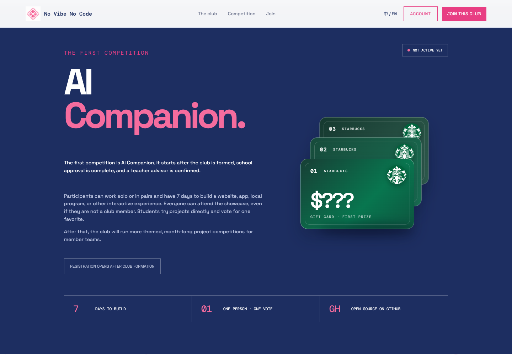

# No Vibe No Code

An interactive bilingual website and member portal for a student-led AI maker
club. The site introduces the club, publishes competition details, registers
members, and gives club leaders a lightweight administration surface.

[Visit the live site](https://novibenocode.ccwu.cc)




## Highlights

- English and Simplified Chinese content with an instant language switcher
- Cursor-reactive 3D club mark and a recruitment-first join flow
- Responsive club, activity, competition, member-directory, and contact sections
- Lightweight interest registration with optional account creation
- Member and non-member registration with timed terms acceptance
- Secure account sessions and editable member profiles
- PNG, JPEG, and WebP profile-image uploads
- Optional GitHub profile README mirroring with image/link resolution and ETag refreshes
- Role-aware administration for leaders, teachers, and maintainers
- Cloudflare-native storage with D1 and R2

## Tech stack

| Layer | Technology |
| --- | --- |
| Frontend | Semantic HTML, modern CSS, vanilla JavaScript |
| Motion | CSS 3D transforms, Canvas API, Anime.js |
| Runtime | Cloudflare Workers |
| Static hosting | Cloudflare Workers Static Assets |
| Database | Cloudflare D1 |
| Object storage | Cloudflare R2 |
| Authentication | PBKDF2-SHA-256 password hashing and secure HTTP-only cookies |
| Tooling | TypeScript, Wrangler, npm |

## Architecture

```text
Browser
├── Static site ─────────────── Cloudflare Workers Static Assets
└── /api requests ───────────── Worker router (src/index.ts)
                                ├── users, sessions, settings ── D1
                                ├── GitHub README snapshots ──── D1
                                └── profile images ───────────── R2
```

The Worker serves static files from `public/` and handles all `/api/*` routes.
Passwords are derived with PBKDF2-SHA-256 before storage. Session identifiers
are stored in D1 and sent only through `Secure`, `HttpOnly`, `SameSite=Lax`
cookies. A member can opt into mirroring the public `README.md` from their
same-name GitHub profile repository. Enabled mirrors refresh on public profile
reads with conditional GitHub requests and keep the last successful snapshot
when GitHub is unavailable.

## Local development

### Prerequisites

- Node.js 20 or newer
- npm
- A Cloudflare account for remote D1/R2 development and deployment

### Install and run

```bash
npm install
npx wrangler d1 migrations apply no-vibe-no-code --local
npm run dev
```

Wrangler prints the local URL, normally `http://localhost:8787`.

### Validate a production build

```bash
npm run check
```

## Cloudflare setup

Create the required resources when deploying into a new Cloudflare account:

```bash
npx wrangler d1 create no-vibe-no-code
npx wrangler r2 bucket create no-vibe-no-code-profile-images
npx wrangler d1 migrations apply no-vibe-no-code --remote
```

Copy the generated D1 database ID into `wrangler.toml`, then configure the
initial club leader:

```bash
npx wrangler secret put INITIAL_LEADER_DISPLAY_NAME
npx wrangler secret put INITIAL_LEADER_PASSWORD
```

The initial leader is created on the first successful login when the users
table is empty.

Deploy the Worker and static assets:

```bash
npx wrangler deploy
```

The included Wrangler configuration targets the custom domain
`novibenocode.ccwu.cc`.

## Project structure

```text
.
├── docs/screenshots/       README screenshots
├── migrations/             D1 schema migrations
├── public/
│   ├── admin.html          Role-protected administration UI
│   ├── app.js              Localization, motion, and browser interactions
│   ├── index.html          Main website and account dialogs
│   └── styles.css          Responsive layout and visual system
├── src/index.ts            Worker API and static-asset router
├── src/github.ts            GitHub fetching, URL resolution, and safe rendering
├── package.json            Scripts and dependencies
└── wrangler.toml           Cloudflare bindings and deployment configuration
```

## Available scripts

| Command | Purpose |
| --- | --- |
| `npm run dev` | Start the local Wrangler development server |
| `npm run check` | Build a deployment bundle without publishing |
| `npm run deploy` | Deploy the Worker and static assets |

## License

Released under the [MIT License](LICENSE).
