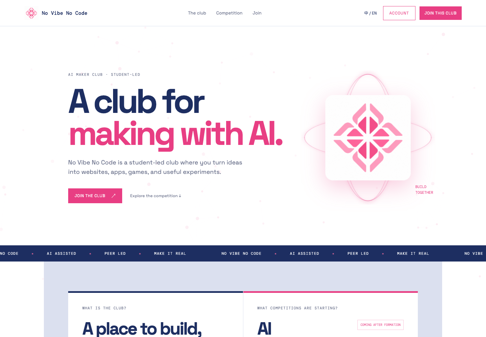

# No Vibe No Code

A bilingual website and member portal for a student-led AI maker club. Members
can create public profiles, share projects, join teams, and claim NFC profile
cards. Club leaders manage accounts, forms, projects, and card issuance.

[Visit the live site](https://novibenocode.ccwu.cc)



## Current member experience

- The member workspace has dedicated `/projects`, `/teams`, and
  `/notifications` pages, with a shared header, account menu, and centered
  public-site footer. `/home` is an overview with accurate counts and up to
  five pinned/recent projects and teams.
- Projects support search, status/visibility/team/label filters, sorting,
  list/grid views, personal pins, and pagination. Each `/projects/:slug`
  page has an Overview, Markdown Editor, and Settings. Owners can upload a
  cover, associate a team, submit for staff review, archive, and restore to Draft.
- Teams have searchable Active, Archived, and Invitations views. Each
  `/teams/:slug` page has Overview, Projects, Members, and Settings tabs,
  including an avatar, Markdown introduction, website, member search,
  invitations, ownership transfer, and archive/restore controls.
- Notifications have Inbox, Unread, Saved, and Done views; category filters;
  individual and bulk actions; and invitation acceptance/decline in the detail
  pane. Mobile opens one detail at a time. Unread badges refresh after actions,
  on focus, and every 60 seconds while the page is visible.
- Display, filter, sort, and pin preferences are stored in the member account,
  not just this browser. Projects default to list view and Teams to grid view.
- Create an account and edit a public profile at `/profile.html?edit=1`. The
  owner can upload a PNG, JPG, or WebP photo under 2 MB, write a bio and README,
  add public links, and choose which contact details to publish.
- Import a public GitHub profile README from the matching
  `username/username` repository. The last successful import remains visible
  if GitHub is temporarily unavailable. Members can also publish a local README.
- Claim a card on its first `/nfc/<token>` scan after signing in or creating an
  account. Later scans open the owner's public profile by default. The owner
  can set or clear a separate HTTP(S) destination for each claimed card under
  **Edit profile → My NFC cards**. Card tokens stay on the physical card and
  are not returned by the profile settings API.
- View the closed card-design vote at `/vote`. Cloud Cat won with the highest
  average rating. The page displays the selected front and back art and final
  participation totals; new ratings are rejected by the API.
- Visit `/chart` for a separate site redirect to the linked YouTube video.

The selected card artwork is stored at
[`public/card-variants/cloud-cat-front.png`](public/card-variants/cloud-cat-front.png)
and [`public/card-variants/cloud-cat-back.png`](public/card-variants/cloud-cat-back.png).
These are the original supplied PNGs, without cropping or recompression.

## Tech stack

| Layer | Technology |
| --- | --- |
| Frontend | Semantic HTML, modern CSS, vanilla JavaScript |
| Runtime and static assets | Cloudflare Workers |
| Database | Cloudflare D1 |
| Profile photos, project covers, and team avatars | Cloudflare R2 |
| Authentication | PBKDF2-SHA-256 passwords, secure HTTP-only session cookies |
| Build and deployment | TypeScript, esbuild, Wrangler, npm |

The Worker in `src/index.ts` handles API routing and friendly site routes.
`src/workspace.ts` implements profile, staff-review, vote-result, and NFC APIs.
`src/member-workspace.ts` implements projects, teams, notifications, and
account preferences. The client is still static JavaScript, not a new framework.
`src/github.ts` imports and sanitizes public GitHub README content. Static
pages and browser scripts live in `public/`; schema changes live in
`migrations/`.

## Workspace routes and permissions

| Route | Purpose |
| --- | --- |
| `/home` | Signed-in counts, pinned/recent work, and invitation links |
| `/projects`, `/projects/new`, `/projects/:slug` | Project collection, creation, and detail |
| `/teams`, `/teams/new`, `/teams/:slug` | Team collection, creation, and detail |
| `/notifications` | Member inbox with desktop/mobile detail views |
| `/gallery`, `/members`, `/user/:slug` | Visitor-accessible gallery, directory, and profiles |

Detail tabs use `?tab=…`; collection filters, sorting, and view mode use query
parameters. Refresh and Back/Forward preserve them. Old `/home#projects`,
`/home#teams`, `/home?team=…`, and `/project.html?project=…` links still work.
Sign-in returns the member to the requested page.

Project ownership remains individual. Associating a team does **not** grant
shared editing or access to private/unpublished projects. Owners and club
staff can edit projects; only the owner submits for review. Existing staff
review and publishing remain in the staff dashboard. Public projects are
visitor-accessible only after publishing. Members-only published projects
require sign-in; private projects are visible only to their owner and staff.

Team owners manage administrators, ownership, and archive state. Administrators
can edit team details, invite people, cancel invitations, and remove ordinary
members. Other members can leave; owners transfer ownership before leaving.
Archived teams are read-only until restored. Invitations last seven days;
expired invitations can be reissued and former members can rejoin.

### Workspace APIs

- `GET /api/workspace/summary` returns accurate counts and pinned/recent previews.
- `GET/PUT /api/workspace/preferences` reads or merges account preferences.
- `POST /api/workspace/preview` renders sanitized Markdown without saving it.
- `GET/POST /api/projects` lists or creates projects. Listing accepts `mine=1`,
  `q`, `status`, `visibility`, `team`, `label`, `sort=updated|name`, `limit`, and
  `cursor`. `GET/PUT /api/projects/:idOrSlug` reads or updates details.
- `POST /api/projects/:idOrSlug/submit|archive|restore` manages lifecycle.
- `GET/POST /api/teams` lists or creates teams. Listing accepts `q`,
  `status=active|archived|all`, `sort`, `limit`, and `cursor`.
  `GET/PUT /api/teams/:idOrSlug` reads or updates details.
- Team subroutes: `GET /candidates?q=…`, `POST /invitations`,
  `DELETE /invitations/:id`, `PUT /members/:userId`, and
  `POST /leave|transfer|archive|restore`.
- `POST /api/team-invitations/:id/respond` accepts or declines an invitation.
- `GET /api/notifications` accepts `filter=inbox|unread|saved|done`, `type`, `q`,
  `limit`, and `cursor`. Responses include accurate totals and view counts.
  `GET /api/notifications/:id` returns details and current invitation status.
- `POST /api/notifications/:id/action` and `POST /api/notifications/bulk`
  accept `read`, `unread`, `save`, `unsave`, `done`, and `restore`. Bulk requests
  include up to 100 `ids`. Existing `/:id/read`, `/read-all`, and
  `/unread-count` endpoints remain available.
- `GET/POST/DELETE /api/projects/:idOrSlug/cover` and
  `/api/teams/:idOrSlug/avatar` read/upload/remove images. Upload JSON contains
  `dataUrl`; PNG, JPEG, and WebP files are limited to 2 MB. The existing R2
  binding stores these under separate `projects/` and `teams/` prefixes.

Collection responses use `total` and `nextCursor`. Pagination uses stable
timestamp/name plus ID ordering. Preferences have `projects`, `teams`, and
`notifications` sections plus `pinnedProjects` and `pinnedTeams` arrays.

`0009_member_workspace.sql` is additive: cover/labels, avatar/introduction/
website, saved notifications, and account preferences. It retains existing
records, team associations, and archive fields. Apply it before deploying the
new Worker. Issues, boards, comments, dark mode, and email/push are not included.

## NFC and vote APIs

| Route | Purpose |
| --- | --- |
| `GET /api/nfc/cards/<token>` | Check a card and record a scan |
| `POST /api/nfc/cards/<token>/claim` | Bind an unclaimed card to the signed-in member |
| `GET /api/nfc/my-cards` | List the signed-in member's claimed cards without their tokens |
| `PUT /api/nfc/my-cards/<id>` | Set `redirectUrl` to an HTTP(S) URL, or `""` for the profile default |
| `GET /api/vote/results` | Public final ratings and selected winner |
| `POST /api/vote` | Returns HTTP 410 because the vote is closed |

`migrations/0008_nfc_redirects.sql` adds the per-card destination. Existing
cards keep the profile default until their owners choose another link. Do not
put generated NFC token URLs in Git, logs, screenshots, or public documents.

## Local development

Requires Node.js 20 or newer, npm, and Wrangler access to the configured
Cloudflare account for deployment.

```bash
npm install
npx wrangler d1 migrations apply no-vibe-no-code --local
npm run build:assets
npm run dev
```

Wrangler normally serves the site at `http://localhost:8787`. Build the
browser scripts and dry-run the Worker bundle with:

```bash
npm run check
```

Run local-only integration tests against an isolated D1/R2 state directory:

```bash
npm run test:workspace
# Keep the fixture server available at localhost:8791 for browser tests:
npm run test:workspace -- --serve
```

The test runner refuses to use a remote database: all Wrangler storage commands
are explicitly local, and API tests target localhost. It creates owner, admin,
member, outsider, and staff fixtures with synthetic data. Browser credentials
are defined in `tests/workspace.mjs`; they do not exist on production.
Use a free port 8791. Temporary state is retained in the printed OS temp path
for inspection; stop the fixture server with Ctrl+C.

See [workspace validation](docs/workspace-validation.md) for the release checks.

For a new Cloudflare account, create the D1 database and R2 bucket named in
`wrangler.toml`, update the D1 database ID, and configure the initial leader
secrets. Apply all migrations before deploying:

```bash
npx wrangler d1 migrations apply no-vibe-no-code --remote
npm run deploy
```

The deployment script builds the browser assets before publishing. The
Wrangler configuration targets `novibenocode.ccwu.cc`. Verify the live custom
domain separately after each deployment.

## Project structure

```text
.
├── docs/screenshots/       README screenshots
├── migrations/             D1 schema migrations
├── public/                 Pages, scripts, styles, and card artwork
├── src/index.ts            Worker router and legacy account API
├── src/workspace.ts        Profile, staff-review, NFC, and vote APIs
├── src/member-workspace.ts Project, team, inbox, and preference APIs
├── src/github.ts           GitHub README import and safe rendering
├── tests/workspace.mjs     Isolated local integration and fixture runner
├── package.json            Build and deployment scripts
└── wrangler.toml           Cloudflare bindings and custom domain
```

Released under the [MIT License](LICENSE).
